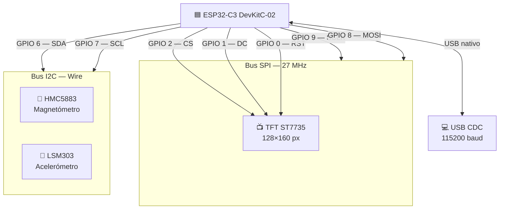
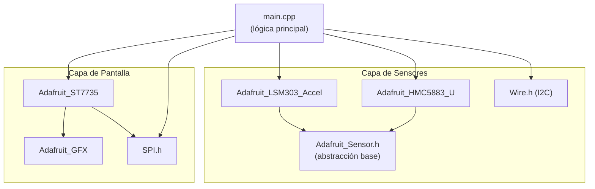
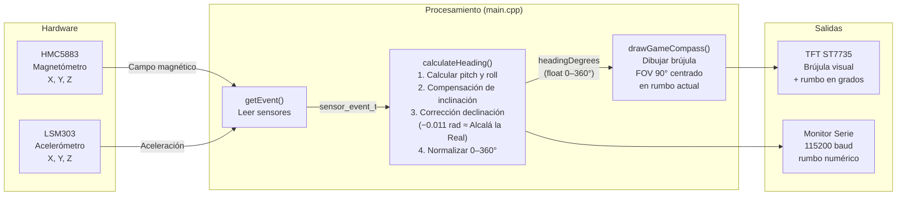
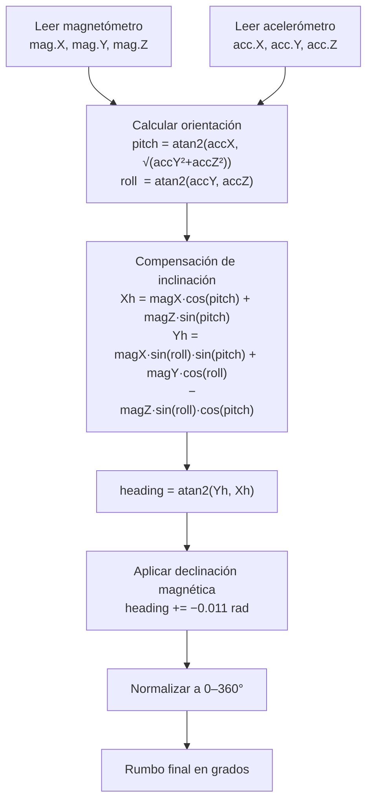

# Diagrama de Conexiones — Brujula (Compass)

## 1. Conexiones de Hardware (Pines ESP32-C3)



---

## 2. Tabla de Pines

| GPIO | Función | Periférico |
|------|---------|-----------|
| 0 | RST | TFT ST7735 |
| 1 | DC | TFT ST7735 |
| 2 | CS | TFT ST7735 |
| 6 | SDA | I2C → HMC5883 + LSM303 |
| 7 | SCL | I2C → HMC5883 + LSM303 |
| 8 | MOSI | SPI → TFT ST7735 |
| 9 | SCLK | SPI → TFT ST7735 |
| USB | CDC | Monitor Serie 115200 |

---

## 3. Dependencias de Software



---

## 4. Flujo de Datos (Loop Principal — cada 30 ms)



---

## 5. Algoritmo de Cálculo de Rumbo



---

## 6. Vista General del Sistema

```
                    ┌─────────────────────────────────────────────────────┐
                    │              ESP32-C3 DevKitC-02                    │
                    │                                                     │
  ┌──────────┐      │  GPIO 9 ──── SCLK ──┐                             │
  │ TFT      │      │  GPIO 8 ──── MOSI ──┤  SPI @ 27 MHz              │
  │ ST7735   │◄─────│  GPIO 2 ──── CS ────┘                             │
  │ 128×160  │      │  GPIO 1 ──── DC                                   │
  └──────────┘      │  GPIO 0 ──── RST                                  │
                    │                                                     │
  ┌──────────┐      │  GPIO 6 ──── SDA ───┐                             │
  │ HMC5883  │◄────►│  GPIO 7 ──── SCL ───┤  I2C                       │
  │ (mag)    │      │                     │                             │
  └──────────┘      │                     │                             │
                    │                                                     │
  ┌──────────┐      │                                                     │
  │ LSM303   │◄────►│  (mismo bus I2C)                                  │
  │ (accel)  │      │                                                     │
  └──────────┘      │                                                     │
                    │                                                     │
  ┌──────────┐      │  USB CDC ──── Monitor Serie @ 115200              │
  │ PC/Debug │◄─────│                                                   │
  └──────────┘      │                                                     │
                    └─────────────────────────────────────────────────────┘
```
