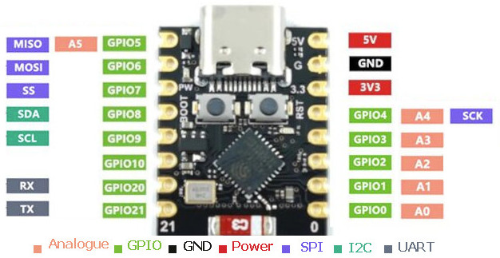

# Documentación - Brújula Compensada

## Board

## Contenido

- **xiao-esp32c3-pinout.jpeg** — Diagrama de pines del Seeed Studio XIAO ESP32-C3
- **Brujula-pin-diagram.html** — Diagrama interactivo de conexiones de pines del ESP32-C3

## Descripción del Proyecto

Brújula digital compensada por inclinación basada en ESP32-C3:
- **Sensor magnético:** HMC5883 (magnetómetro)
- **Sensor inercial:** LSM303 (acelerómetro para compensación de tilt)
- **Pantalla:** TFT ST7735 (128×160 px)
- **Visualización:** Rosa de los vientos estilo videojuego con corrección por inclinación

## Referencias Rápidas

Ver [CLAUDE.md](../CLAUDE.md) para:
- Mapa de pines detallado
- Algoritmo de compensación de tilt
- Flujo de datos en tiempo real
- Comandos de PlatformIO

